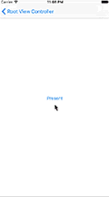
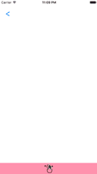

# AICustomViewControllerTransition

Easy and tidy way for creating custom UIViewController transitions for iOS

Create totally custom view controller transitions without the complexity of implementing UIViewControllerAnimatedTransitioning protocol or subclassing UIPercentDrivenInteractiveTransition. You just need to use transitioningDelegate wrappers in this framework and provide your UIView animation code. 

[](https://developer.apple.com/iphone/index.action)
[](https://developer.apple.com/swift)
[](http://mit-license.org)

   

Drag Down icon used in examples and screenshots is by IconMafia from thenounproject.com (https://thenounproject.com/search/?q=drag&i=463918)

##Requirements
- iOS 8.1+
- Xcode 7.3

## Installation

> **Embedded frameworks require a minimum deployment target of iOS 8.**
>
> To use with a project targeting iOS 7, or if you don't want to use CocoaPods you must include the `AICustomViewControllerTransition.swift` source file directly in your project. 
>

---

## Usage

### 1. Create a custom transitioning delegate object

- SimpleTransitioningDelegate

If you don't want your transition to be interactive

```swift
let mySimpleTransitioningDelegate = SimpleTransitioningDelegate()
```

- InteractiveTransitioningDelegate

If you want your transition to be interactive as well. Includes all the functionality of SimpleTransitioningDelegate

```swift
let myInteractiveTransitioningDelegate = InteractiveTransitioningDelegate()
```

### 2. Assign animation closures to your transitioning delegate

- transitionPresent

Animate transition for presenting your modal view controller. See SimpleTransitionViewController example in the Example project. 

```swift
mySimpleTransitioningDelegate.transitionPresent = { [weak self] (fromViewController: UIViewController, toViewController: UIViewController, containerView: UIView, isInteractive: Bool, isInteractiveTransitionCancelled: Bool, completion: () -> Void) in

	UIView.animateWithDuration(animationDuration, animations: {
		// Your custom presentation animation here
		// Use provided viewController views to animate
	}, completion: { (finished) in
		// Do't forget to execute completion closure
		completion()
	})
}
```

- transitionDismiss

Animate transition for dismissing your modal view controller. See SimpleTransitionViewController example in the Example project. 

```swift
mySimpleTransitioningDelegate.transitionDismiss = { [weak self] (fromViewController: UIViewController, toViewController: UIViewController, containerView: UIView, isInteractive: Bool, isInteractiveTransitionCancelled: Bool, completion: () -> Void) in

	UIView.animateWithDuration(animationDuration, animations: {
		// Your custom dismissal animation here
		// Use provided viewController views to animate
	}, completion: { (finished) in
		completion()
	})
}
```

- transitionPercentPresent

Animate percent driven interactive transition for presenting your modal view controller. See PanToViewTransitionViewController and ExpandingCellsTableViewController examples in the Example project.

```swift
myInteractiveTransitioningDelegate.transitionPercentPresent = {[weak self] (fromViewController: UIViewController, toViewController: UIViewController, percentage: CGFloat, containerView: UIView) in
	// Animate your view controllers using provided percentage
	// Because the transition is progressive, you probably don't need an animation block here
}
```

- transitionPercentDismiss

Animate percent driven interactive transition for dismissing your modal view controller. See PanToViewTransitionViewController and ExpandingCellsTableViewController examples in the Example project.

```swift
myInteractiveTransitioningDelegate.transitionPercentDismiss = {[weak self] (fromViewController: UIViewController, toViewController: UIViewController, percentage: CGFloat, containerView: UIView) in
	// Animate your view controllers using provided percentage
	// Because the transition is progressive, you probably don't need an animation block here
}
```

### 3. Begin, update and finalize a percent driven interactive transition

Use below methods if you are using an InteractiveTransitioningDelegate as your transitioning delegate. See PanToViewTransitionViewController and ExpandingCellsTableViewController examples in the Example project. 

- beginPresentingViewController(_:fromViewController:) or beginDismissingViewController(_:)

Begin presenting your modal view controller, usually in the callback method for a gesture recognizer that your user interacts with.

```swift
myInteractiveTransitioningDelegate.beginPresentingViewController(myModalViewController, fromViewController: self)
```

- updateInteractiveTransition(_:)

Update the percentage of your transition, usually in the callback method for a gesture recognizer that your user interacts with.

```swift
myInteractiveTransitioningDelegate.updateInteractiveTransition(percentage)
```

- finalizeInteractiveTransition(isTransitionCompleted:)

End presenting or dismissing an interactive transition.

```swift
myInteractiveTransitioningDelegate.finalizeInteractiveTransition(isTransitionCompleted:true)
```

### 4. Present your view controller as usual

If you are not presenting your view controller in an interactive way, present your view controller as usual. Even if you are using an InteractiveTransitioningDelegate you can still choose to present or dismiss your view controller automatically without a progressive interaction from user, e.g. user taps the button only once. See PanToViewTransitionViewController in Example project. 

```swift
myModalViewController.modalTransitionStyle = .Custom
myModalViewController.transitioningDelegate = myInteractiveTransitioningDelegate //or mySimpleTransitioningDelegate
self.presentViewController(self.detailViewController, animated: true, completion: nil)
```

## License

AICustomViewControllerTransition is released under the MIT license. See LICENSE for details.
